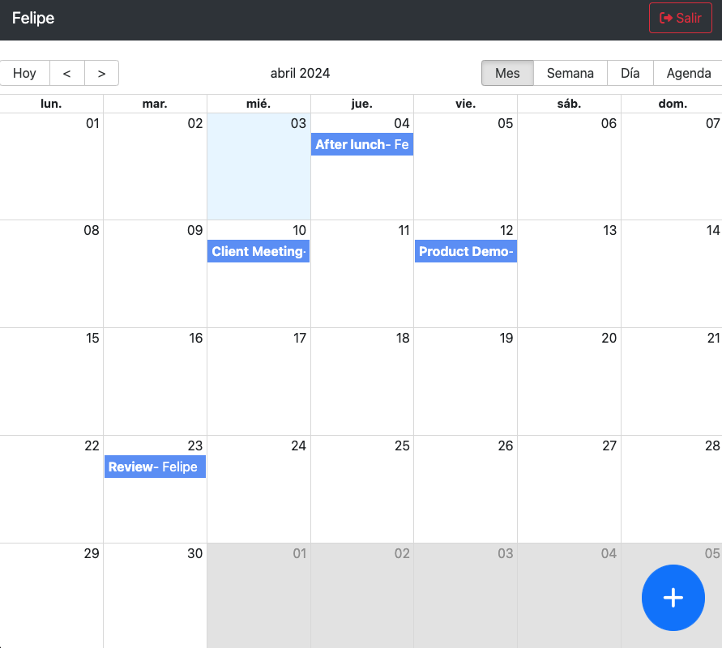

# React Calendar App

A React App to handle events within a calendar

## Description

In this app I use a backend server with different endpoints to handle events of a calendar.

## Getting Started

### Dependencies

- `npm`
- `node`
- Backend Server: Here is an example that I use in this repository: https://github.com/Felipe-Navas/node-calendar-app

### Installing

- Clone the repository and install dependencies:

```
git clone https://github.com/Felipe-Navas/react-calendar-app.git && cd react-calendar-app && npm install
```

- Configure your `.env` file (depending of your environment: development, production, test) in the root of the project and configure the `REACT_APP_API_URL` variable with the URL of the Backend Server

### Executing program

```
npm start
```

Preview of the principal page to login:


Preview of the screen of calendar:



Preview of the screen of new event:


### Running tests

```
npm test
```

Preview of the console running the tests:


## Authors

- [Felipe Navas](https://www.linkedin.com/in/felipenavaslederhos) - [Email](mailto:felipenavas.itec@gmail.com?subject=[GitHub]%20react-calendar-app)

## Contributing

1. Fork it (<https://github.com/Felipe-Navas/react-calendar-app/fork>)
2. Create your feature branch (`git checkout -b feature/fooBar`)
3. Commit your changes (`git commit -am 'Add some fooBar'`)
4. Push to the branch (`git push origin feature/fooBar`)
5. Create a new Pull Request

## License

This project is licensed under the [MIT License] - see the LICENSE file for details
